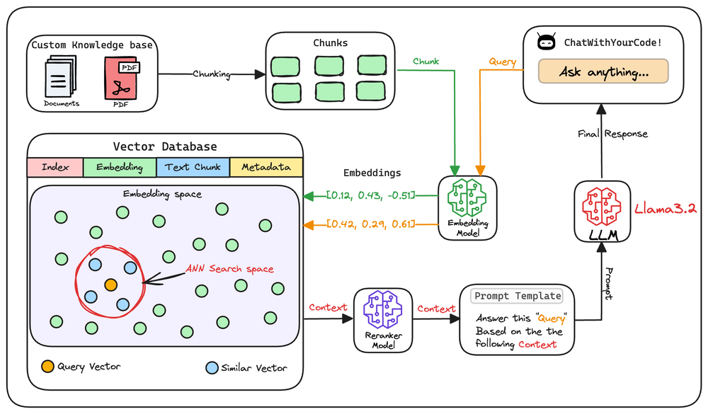

# RAG Pipeline — End to End

A production-grade **Retrieval-Augmented Generation (RAG)** pipeline built from scratch. Covers the full lifecycle: document ingestion, chunking, embedding, vector indexing, ANN retrieval, cross-encoder re-ranking, prompt engineering, and LLM response generation.

---

## Tech Stack

<p>
  
  
  
  
  
  
  
  
</p>

---

## Architecture



---

## How It Works

### Stage 1 — Offline Indexing (Build Time)

This stage runs once (or whenever the knowledge base is updated). It prepares the external knowledge for fast, semantically-aware retrieval.

#### Step 1 · Chunking

Raw documents (PDFs, text files) are loaded and split into smaller, overlapping chunks using `RecursiveCharacterTextSplitter`.

**Why chunk?**  
Embedding models have a fixed input size. Feeding an entire document produces a single vector — too coarse to retrieve specific facts. Chunking ensures each vector represents a focused semantic unit. Overlap between chunks prevents context from being lost at boundaries.

```
chunk_size=1000, chunk_overlap=200
```

#### Step 2 · Embedding

Each chunk is encoded into a dense vector using a **bi-encoder** (`all-MiniLM-L6-v2` from Sentence Transformers).

Bi-encoders process each text independently and are extremely fast — ideal for encoding an entire corpus offline. The resulting vectors capture semantic meaning, not just keyword overlap.

```
embeddings = model.encode(chunks)  # shape: (N, 384)
```

#### Step 3 · Vector Indexing

Embeddings are stored in **FAISS** (`IndexFlatL2`) along with their source text metadata.

FAISS enables sub-millisecond approximate nearest-neighbor (ANN) search over millions of vectors. Metadata is stored alongside so the original text can be returned with each result.

```
index = faiss.IndexFlatL2(dim)
index.add(embeddings)
```

---

### Stage 2 — Online Query (Inference Time)

This stage runs on every user query. It retrieves, refines, and generates.

#### Step 4 · Query Embedding

The user's query is encoded with the **same bi-encoder** used at indexing time.

Embedding space alignment is critical — the query vector and chunk vectors must live in the same space for cosine/L2 similarity to be meaningful.

```
query_vec = model.encode([query])  # shape: (1, 384)
```

#### Step 5 · ANN Retrieval

FAISS searches the index for the `top-k` nearest chunk vectors to the query vector.

This is a fast, approximate search — it trades a small amount of recall for significant speed gains at scale. The result is a candidate set of `k` chunks that are semantically close to the query.

```
D, I = index.search(query_vec, top_k=10)
```

#### Step 6 · Cross-Encoder Re-ranking

The candidate chunks are re-scored by a **cross-encoder** (`ms-marco-MiniLM-L-6-v2`).

Unlike bi-encoders, cross-encoders take the query _and_ a chunk as a joint input, enabling full attention across both. This is far more accurate than vector similarity alone but too slow for full-corpus search — so it's applied only to the shortlisted candidates.

```
pairs = [(query, chunk) for chunk in candidates]
scores = cross_encoder.predict(pairs)
reranked = sorted(zip(chunks, scores), key=lambda x: x[1], reverse=True)[:3]
```

#### Step 7 · Prompt Construction

The top re-ranked chunks are assembled into a structured prompt template with the user's original query.

Grounding the LLM with retrieved context is what separates RAG from vanilla generation. The model is explicitly told to answer based on the provided context, reducing hallucination.

```
prompt = f"Answer this query: '{query}'\n\nContext:\n{context}\n\nAnswer:"
```

#### Step 8 · LLM Response Generation

The grounded prompt is sent to **Llama 3.2** via **Groq's inference API**.

Groq's LPU hardware delivers extremely low-latency inference. The LLM synthesizes the retrieved context into a coherent, grounded answer — it doesn't generate from parametric memory alone.

```
response = llm.invoke([prompt])
```

---

## Key Design Decisions

| Decision                              | Why                                                               |
| ------------------------------------- | ----------------------------------------------------------------- |
| Bi-encoder for retrieval              | Fast enough to search millions of vectors in milliseconds         |
| Cross-encoder for re-ranking          | Significantly higher precision on a small candidate set           |
| Chunking with overlap                 | Prevents semantic context loss at chunk boundaries                |
| FAISS over ChromaDB for primary store | Lower latency, no server dependency, pure in-memory ANN           |
| Groq for inference                    | Fastest open-model inference available; ideal for low-latency RAG |
